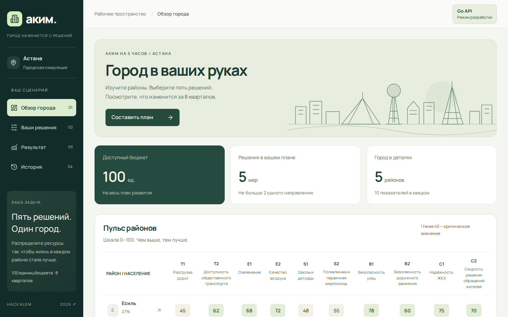
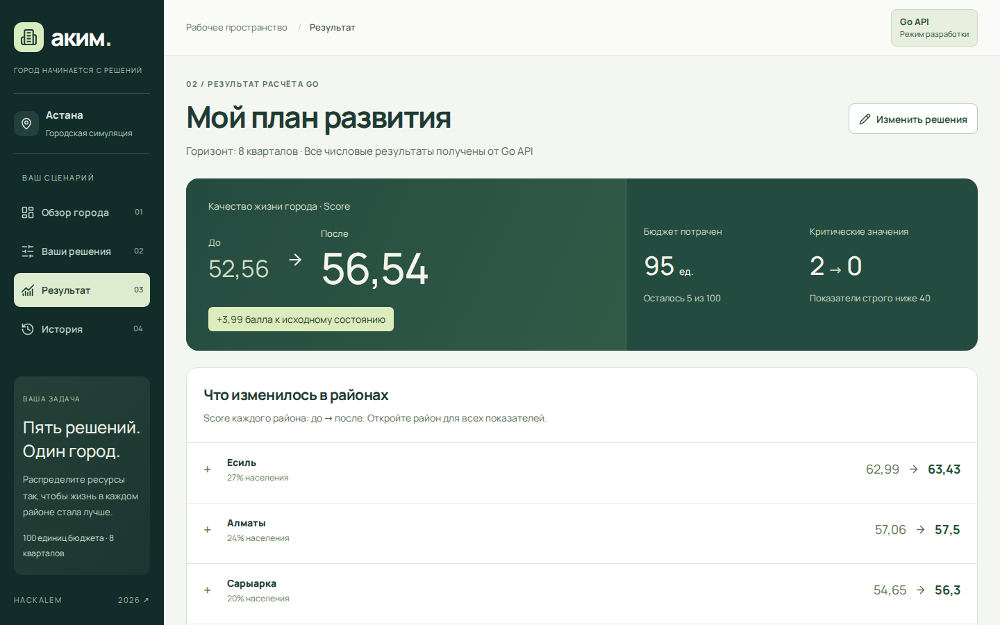

# «Аким на 5 часов» — AI-симулятор управления городом

HackAlem AI · Astana Innovations Special Track · команда AI4EDU

Бюджет **100**, **5 районов Астаны**, **14 мер** и ровно **5 решений**.
Пользователь распределяет ресурсы между транспортом, экологией, соцсферой,
безопасностью и городскими сервисами. Детерминированный движок считает
**Astana Quality of Life Score**, а AI объясняет сильные стороны, риски
и компромиссы выбранного сценария.



## Проблема и решение

Ресурсы города ограничены, а у решений есть неочевидные последствия:
мера начинает работать не сразу (лаг), одни меры усиливают друг друга (синергии),
другие несовместимы, а вложения в один район не помогают отстающему.
Симулятор позволяет безопасно попробовать разные стратегии и увидеть,
как они меняют каждый район и город в целом.

1. **Проверка сценария:** бюджет, ровно 5 уникальных решений, не больше 2 мер
   одного направления, районные и городские меры, несовместимости.
2. **Расчёт:** эффекты с учётом лага `(8 − L) / 8`, синергии, ограничение [0, 100],
   районные Score, итог `0.7 × среднее по населению + 0.3 × худший район − критические`.
3. **AI-объяснение:** сильные стороны, риски и компромиссы на русском языке.
4. **Лучший план:** точный оптимум полным перебором всех 694 395 допустимых сценариев.



## Почему AI не считает цифры

Score, стоимость, валидность и оптимум считает только Go-движок: одинаковый
вход всегда даёт одинаковый результат. LLM получает уже готовый результат
и пишет только текст объяснения; промпт запрещает пересчитывать или придумывать
числа. Без ключа, без сети или при ошибке провайдера сервер возвращает
содержательное шаблонное объяснение (`source: "fallback"`), а цифры не меняются.
Так результат честный и воспроизводимый для всех команд.

```
React-сайт  →  Go API: валидация → расчёт → оптимизатор  →  LLM: только текст
                    (все числа)                              (fallback без сети)
```

## Результаты

| Сценарий | Стоимость | Score | Критических |
|---|---:|---:|---:|
| Ничего не делать (база) | 0 | 52.558 | 2 |
| Всё вложить в богатый Есиль | 93 | 53.577 | 2 |
| Полезная мера в неудачном месте (M11 в Алматы) | 93 | 55.144 | 1 |
| Сбалансированный golden: M7, M8, M10 → Нура; M12 город; M5 → Сарыарка | 95 | 56.543 | 0 |
| **Лучший план:** M2, M14 город; M3, M8, M9 → Нура | 98 | **57.237** | 0 |

Все числа таблицы независимо пересчитывает `make verify`
([scripts/verify_scores.py](scripts/verify_scores.py)): вторая реализация
формулы на Python в точных дробях, без общего кода с Go-движком, плюс
полный перебор для проверки оптимума.

Вклад в один район почти не повышает Score: 30% веса у худшего района
и штраф за каждый показатель ниже 40 не дают «забыть» Нуру.
Сценарий показа с командами: [docs/demo.md](docs/demo.md).

## Документация

- [docs/task.md](docs/task.md) — постановка задачи
- [docs/scoring.md](docs/scoring.md) — данные, меры и формула Score
- [docs/api.md](docs/api.md) — контракт HTTP API
- [docs/demo.md](docs/demo.md) — сценарий показа для жюри
- [web/README.md](web/README.md) — фронтенд

## Запуск

```sh
docker compose up --build
```

Открыть **http://localhost:8080** — сайт и API на одном адресе. Первая сборка — 1–2 минуты; «Лучший план» доступен через ~15 с после старта.
`.env` не обязателен. Для живого AI: `cp .env.example .env` и вписать `OPENAI_API_KEY`; без ключа работает шаблонное объяснение.

## Демо для жюри

1. Запустить проект (см. «Запуск» выше) и дождаться сборки.
2. Открыть **http://localhost:8080**: исходные показатели районов, в Нуре
   два критических значения (S1, S2 < 40). Базовый Score 52.56 виден
   на экране результата как «До».
3. «Составить план» → добавить M7, M8, M10 → Нура, M12 (город), M5 → Сарыарка →
   «Рассчитать результат»: Score 56.54, стоимость 95, критических 0,
   сработала синергия M10 + M12, объяснение с меткой AI или шаблона.
4. «Лучший план по модели»: точный оптимум 57.24 (M2, M14; M3, M8, M9 → Нура).
   Первые ~15 секунд после старта сервер ещё считает и показывает «Считается…».
5. Попробовать нарушить правила (M1 + M3, третью меру соцсферы, перерасход
   бюджета): Score не выдаётся, показывается причина.

Те же шаги через curl и дополнительные сценарии: [docs/demo.md](docs/demo.md).

## Проверка

```sh
make check                      # Go: формат, vet, тесты, race
make verify                     # независимый пересчёт на Python + полный перебор
cd web && npm ci && npm test     # тесты фронтенда
```

## Архитектура

- `internal/simulation` — данные, валидация и детерминированный расчёт Score.
- `internal/explanation` — AI-объяснение результата и шаблонный fallback.
- `internal/httpapi` — HTTP API расчёта, объяснения и рекомендаций.
- `internal/optimizer` — полный перебор сценариев через `simulation.Simulate`.
- `internal/httpapi/web.go` — раздача собранного сайта рядом с API.
- `web/` — React + TypeScript + Vite; числа получает от API.
- `cmd/server` — запуск сервера и настройка из переменных окружения.

## Настройки

| Переменная | По умолчанию | Назначение |
|---|---|---|
| `ADDR` | `:8080` | Адрес Go API |
| `OPENAI_API_KEY` | пусто | Ключ для живого AI |
| `OPENAI_MODEL` | `gpt-4.1-mini` | Модель объяснения |
| `CORS_ORIGIN` | пусто | Разрешённый origin отдельного фронтенда |
| `WEB_DIR` | пусто; `/web` в Docker | Каталог собранного сайта |
| `HOST_PORT` | `8080` | Внешний порт Docker |

## Разработка

`make web-install` — установить зависимости фронтенда; `make run` — запустить Go API на :8080.
`make web-dev` — сайт на http://127.0.0.1:5173 с прокси `/api` (в другом терминале).
`make help` — все цели.
